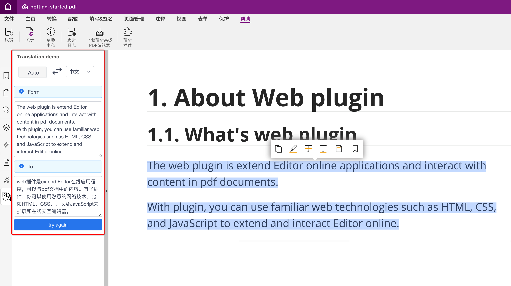

# Webplugin Translation Tool


## Introductions
The translation plug-in based on Editor Online and Web Plugin SDK.

You can choose to translate the contents of PDF documents in real time.


## Screenshot




## Develop
```
npm install
```

### Compiles and hot-reloads for development
```
npm run serve
```

### Compiles and minifies for production
```
npm run build
```


